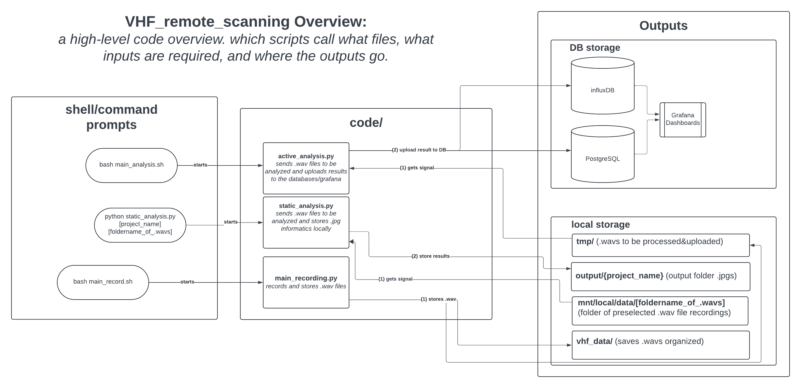

# VHF_remote_scanning
### A repo for automatic and continuous signal collection, analysis, and display of VHF data tags 

## How to run 

### Live Recording and Analysis: Use in the field 
> source main_recording.sh
then, in a new shell: 
> source main_analysis.sh
together, main_recording.sh and main_analysis.sh are bash files for recording, processing, and uploading signals all together. They're created to kick off all processes that you need for VHF detection in the field. when called, main_recording.sh will begin one python scripts: 
1. Main_recording.py (connects to the biotracker, iterates through frequencies and gains stored in the config file, and stores ten second .wav files to be processed)
   
And main_analysis.sh will begin another python script: 
2. active_analysis.py (checks the /tmp folder for files, applies signal analysis and then uploads results of analysis to databases/Grafana)

The result of main_recording.sh+main_analysis.sh is signal recording and immediate analysis that will upload for viewing in realtime to the Grafana dashboard. Both recording and analysis will continue until the user quits both programs manually.
video tutorial: https://drive.google.com/file/d/1kpdCpp07WtdmXZ_Yvk2V8yeNDg6so5cR/view?usp=drive_link
### If you want to test the code, view signals locally, etc. etc.
> python static_analysis.py [project_name] [folder_of_.wavs]

static_analysis.py is a python script for applying signal analysis to files that have already been recorded and stored. It iterates through [folder_of_.wavs], applies the current signal analysis code to each, and then creates a recording_name_panel.jpg that provides insight into what and how the signal analysis is performing. This is for testing and improving the signal analysis code and it does not upload the results of the analysis. video tutorial: https://drive.google.com/file/d/17oeYqaNopPpAgwbeD-y-EeTliVbYwmvB/view?usp=drive_link

The result of static_analysis.py is a folder titled [project_name] located in output/ that contains recording_name_panel.jpgs.
-----

For more (MUCH more) detail, see docs here:
(https://docs.google.com/document/d/1twtguHGBOfBKh4gVZfjrRDqOav9ihgneVI4snDPAUtI/edit?usp=sharing)
All documentation and tutorial videos are stored here: 
https://drive.google.com/drive/folders/16W-jxM42qC-b15STpqYTXk1qJrdfhZoX?usp=drive_link
-----

